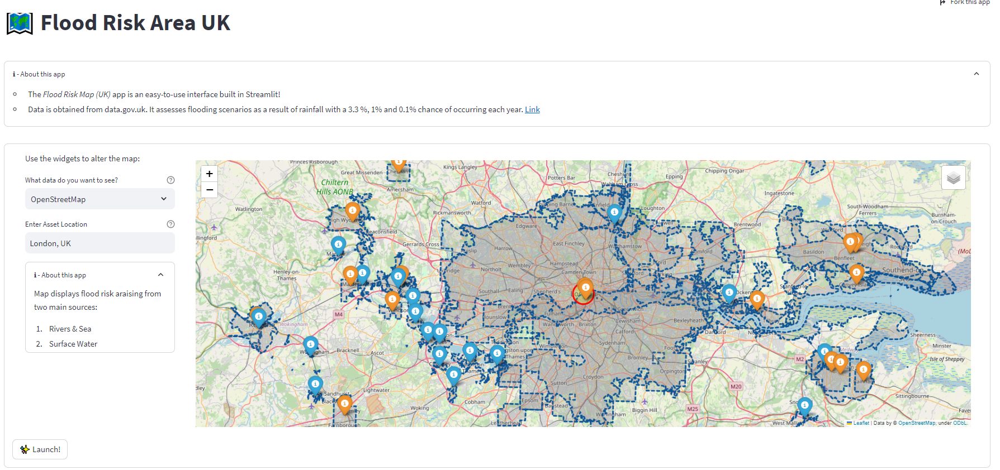

# Flood Risk Assessment App for the UK



## Overview

The **Flood Risk Assessment App** is a web-based application developed to assess flood risk in the United Kingdom. This app utilizes data from various sources, including topography, weather forecasts, river data, and historical flood records, to provide users with valuable insights into flood risk in different regions of the UK. Whether you are a homeowner, property developer, or simply curious about flood risk in your area, this app can help you make informed decisions.

## Features

### 1. Interactive Map

- View an interactive map of the UK.
- Zoom in and out to explore specific regions and areas.
- Easily locate your property or area of interest.

### 2. Flood Risk Assessment

- Access real-time flood risk assessments for different regions.
- Evaluate flood risk based on multiple factors, including rainfall forecasts, river levels, and historical data.
- Receive flood risk scores and recommendations for your selected area.

### 3. Historical Data

- Access historical flood data to understand past flood events in your area.
- Explore flood frequency and severity over time.

### 4. Customizable Alerts

- Set up custom alerts for your area to receive notifications about changing flood risk conditions.
- Stay informed and take proactive measures during flood events.

### 5. Educational Resources

- Access educational resources and information about flood prevention and preparedness.
- Learn how to protect your property and loved ones from flooding.

## Installation

To run the Flood Risk Assessment App locally, follow these steps:

1. Clone the repository to your local machine:

   ```
   git clone https://github.com/yourusername/flood-risk-assessment-app.git
   ```

2. Navigate to the app's directory:

   ```
   cd flood-risk-assessment-app
   ```

3. Install the required dependencies:

   ```
   pip install -r requirements.txt
   ```

4. Run the app:

   ```
   streamlit run app.py
   ```

The app will open in your web browser, allowing you to interact with it locally.

## Data Sources

The Flood Risk Assessment App relies on data from various sources, including:

- UK Met Office for weather and rainfall forecasts.
- Environment Agency for river data and flood risk assessments.
- Historical flood records from government agencies.

## Contributing

We welcome contributions from the community to improve and enhance this app. If you would like to contribute, please follow these guidelines:

1. Fork the repository.
2. Create a new branch for your feature or bug fix: `git checkout -b feature/your-feature`.
3. Make your changes and commit them with descriptive commit messages.
4. Push your changes to your fork: `git push origin feature/your-feature`.
5. Create a pull request, explaining the changes and their purpose.

## Feedback and Support

If you encounter any issues, have suggestions for improvements, or need assistance with using the app, please feel free to [open an issue](https://github.com/yourusername/flood-risk-assessment-app/issues) on GitHub.

## Disclaimer

This app provides flood risk assessments based on available data sources and forecasts. It is for informational purposes only and should not be used as the sole basis for critical decisions. Always follow guidance from local authorities and emergency services during flood events.

## License

This Flood Risk Assessment App is released under the [MIT License](LICENSE.md).

---

Thank you for using the Flood Risk Assessment App. We hope it helps you better understand flood risk in the UK and empowers you to take appropriate actions to protect yourself and your property.
